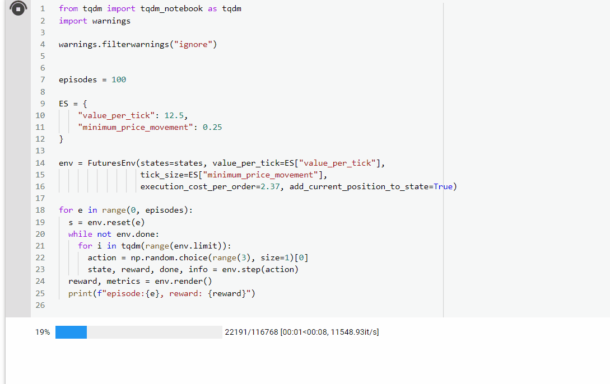

# futures-trading-gym
An OpenAI gym environment for futures trading


The futures market is different than a typical stock trading environment, in that
contracts move in fixed increments, and each increment (tick) is worth a variable
amount depending on the contract traded.

**This environment is designed for a single contract - for a single security type.**


Accompanying this environment is the concept of a `TimeSeriesState`, which is a variable
(n x m) window of all the features representing the state, where n represent the number of steps in the window and m represents the number of features.

This allows you to define the state that your agent uses to determine the action. Some possibillities are:
 -  An embedding
 -  A window of the last 20 observed values
 - A scalogram from a wavelet transform
 - A stack of scalograms
 - Etc. 

See `envs.utils.TimeSeriesState` for more details

### Action Space
This environment accepts 3 different actions at any time state:
  - `0` - a buy -> (long, 1)
  - `1` - a hold (no action) -> (idle, 0)
  - `2` - a sell -> (short, -1)

The environment does not allow for more than one contract to be traded at a time.
If a buy action is submitted with an existing long trade, the action defaults to
no action.

### Deterministic vs Probabilistic Behavior

This environment can also simulate the probabilistic dynamics of actual market trading
through the `fill_probability` and long/short probability vectors. Occasionally,
an order will not fill, or will fill at a price that differs from the intended price. See `generate_random_fill_differential` for usage details. If deterministic
behavior is desired, do not supply these arguments

### Reward Function
The standard reward function is the net profit per **completed** trade, where net profit is equal to

```
 ((entry_price - exit_price) / tick_size) * value_per_tick) 
- execution_cost_per_order * 2 
```

### Output
At the end of each episode, the environment reports metrics as well as distributions of profit/loss and trade duration

A list of metrics:
- Total Net Profit
- Intraday Low
- Profit Factor
- Win_Percentage
- Loss Average
- Intraday Low
- Payout Ratio
- Maximum Win
- Average Win
- Maximum Loss
- Expectancy
- Average Loss
- Total Net Profit (shorts)
- Profit Factor (shorts)
- Total Number of Shorts
- Win Percentage (shorts)
- Maximum Win (shorts)
- Average Win (shorts)
- Maximum Loss (shorts)
- Average Loss (shorts)
- Total Net Profit (longs)
- Profit Factor (longs)
- Total Number of Shorts
- Win Percentage (longs)
- Maximum Win (longs)
- Average Win (longs)
- Maximum Loss (longs)
- Average Loss (longs)
- Profit Loss Monotonicity 

If necessary, you can extract the raw trade data by calling `get_trade_data()`at the end of the epoch. This will allow you to calculate any additional metrics/visualizations. etc. This is cleared at the end of the episode


# Usage
To use this environment, you will need to do the following:

1. Create a custom `TimeSeriesState` by subclassing it and overwriting the `get_feature_vector()` method 
2. Convert your data into a set of your custom `TimeSeriesState` objects
3. Run your episodes

Example:

```python 
import pandas as pd
import numpy as np
import torch

from gym_futures import FuturesEnv

data = pd.read_csv("data_es_11_13.csv")
data = data.sort_values(by="time", ascending=True)

states = []
window_size = 5

# create custom TimeSeriesState
class WindowedTimeSeries(TimeSeriesState):
  def  __init__(self, data, window_size, timestamp_format):
    super().__init__(data,timestamp_format=timestamp_format)
    self.window_size = window_size

  def  to_feature_vector(self, *args, **kwargs):
    """A simple tensor"""
    data = np.array(self.data.iloc[:, 1], dtype=np.float64)
    return torch.tensor(data)

# convert data into states
for i in range(0,len(data)-window_size):
  window = data.iloc[i:i+window_size]
  state = WindowedTimeSeries(window, 
                             window_size=window_size,
                             timestamp_format="%Y-%m-%d %H:%M:%S.%f")

  states.append(state)

# run your environment
from tqdm import tqdm_notebook as tqdm
import warnings
warnings.filterwarnings("ignore")

episodes = 100

ES = {
  "value_per_tick": 12.5,
  "minimum_price_movement": 0.25
}

  

env = FuturesEnv(states=states, value_per_tick=ES["value_per_tick"],
                 tick_size=ES["minimum_price_movement"], execution_cost_per_order=2.37, 
                 add_current_position_to_state=True)

for e in range(0, episodes):
  s = env.reset(e)

  while not env.done:
    for i in tqdm(range(env.limit)):
      # replace np.random.choice with a 'smarter' agent
      action = np.random.choice(range(3), size=1)[0]
      state, reward, done, info = env.step(action)
  
  reward, metrics = env.render()
  print(f"episode:{e}, reward: {reward}")

```



  